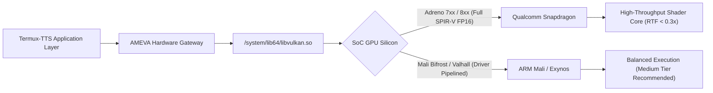

# Termux-TTS: Enterprise 4-Tier On-Device Speech Synthesis Framework

[](https://pypi.org/project/termux-tts/)
[](https://pypi.org/project/termux-tts/)
[](https://www.npmjs.com/package/termux-tts)
[](https://github.com/uno-km/termux-tts)
[](https://www.vulkan.org/)

> **Termux-TTS** is an industrial-grade, zero-compromise on-device Text-to-Speech (TTS) engine designed specifically for Android Termux, mobile ARM64 Linux, and resource-constrained edge environments. By harmonizing an ultra-fast zero-dependency DSP formant vocoder, native Android OS voice bridge IPC, and pure C++ Vulkan GPU NCNN neural tensor compute (VITS / Piper), Termux-TTS delivers instantaneous sub-50ms acoustic synthesis and studio-grade neural voice reproduction without cloud telemetry, subscription fees, or silent quality degradation.

---

## 1. Installation Guide

Termux-TTS is distributed across both Python (PyPI) and Node.js (npm) ecosystems. It operates entirely in unprivileged user-space on Android Termux (ARM64) and Linux x86_64/ARM64.

### 1.1 Prerequisites on Android Termux
Update package repositories and install foundational build tools and system audio utilities:
```bash
pkg update -y
pkg install -y clang python python-numpy nodejs termux-api pulseaudio
```

### 1.2 Python SDK & Global CLI Installation
Install the core package from PyPI via `pip`:
```bash
pip install --upgrade pip
pip install termux-tts
```

To install with neural execution and development extras:
```bash
pip install "termux-tts[neural,dev]"
```

### 1.3 Node.js / TypeScript SDK & CLI Installation
Install globally or locally inside your Node.js application via `npm`:
```bash
# Global CLI installation
npm install -g termux-tts

# Project dependency installation
npm install termux-tts
```

---

## 2. GPU Hardware Acceleration Provisioning (`ameva-runtime`)

To unlock raw mobile GPU compute via Vulkan SPIR-V compute pipelines on Qualcomm Adreno or ARM Mali silicon, pair `termux-tts` with the unified `@ameva/runtime` hardware acceleration layer and run the automated 1-click provisioning tool.

### 2.1 Unified Installation Command
Install both the speech engine and the hardware acceleration runtime simultaneously:

```bash
# Python Environment
pip install termux-tts ameva-runtime

# Node.js / JavaScript Environment
npm install -g termux-tts @ameva/runtime
```

### 2.2 1-Click Automated Binary & Model Provisioning
Termux-TTS provides a built-in automated installer that downloads pre-compiled native ARM64 Vulkan binaries (`sherpa-ncnn-offline-tts`) and studio neural weights from Hugging Face with end-to-end self-test verification:

```bash
# Provision Studio Tier (22.05 kHz High-Fidelity Lessac FP16 - 57MB)
termux-tts install --tier high

# Provision Balanced Low-Latency Tier (Amy Medium - 25MB)
termux-tts install --tier medium

# Force re-download and skip audio playback verification
termux-tts install --tier high --force --no-play
```

Once installed, verify full Vulkan GPU compute availability:
```bash
termux-tts doctor
```

---

## 3. Basic Usage Guide

Termux-TTS provides intuitive interfaces across CLI, Python, and Node.js.

### 3.1 Command-Line Interface (CLI)
```bash
# 1. High-Fidelity Vulkan GPU Synthesis to WAV
termux-tts synth -e vulkan --tier high -t "Vulkan GPU neural inference running locally on Android." -o speech.wav

# 2. Instant Zero-Dependency DSP Formant Synthesis (0MB weights)
termux-tts synth -e dsp -t "Real-time speech generation with zero downloaded models." -o dsp_out.wav

# 3. Direct Hardware Speaker Broadcast via Android Native Voice Engine
termux-tts speak -t "Notice: System background maintenance complete." -l en --volume 12

# 4. Synthesize and Play Immediately through Device Speaker
termux-tts synth -e vulkan --tier medium -t "Hello world! This audio is played directly." -o out.wav --play
```

### 3.2 Python SDK
```python
import termux_tts as tts

# High-Fidelity Neural GPU Synthesis
with tts.load(engine="vulkan", tier="high") as engine:
    res = engine.synthesize(
        "Edge computing speech synthesis with native Vulkan acceleration.",
        output="output_vulkan.wav",
        speed=1.0
    )
    print(f"Backend: {res.backend} | Duration: {res.duration_sec:.2f}s | RTF: {res.rtf:.4f}x")

# Zero-Dependency Parametric DSP Vocoder (<50ms latency)
with tts.load(engine="dsp", preset="balanced") as engine:
    res = engine.synthesize("Instant alert generated by parametric DSP.", output="alert.wav")
    print(f"DSP Latency: {res.elapsed_ms:.1f}ms")

# Native Android OS Speech Output (Samsung Voice / Google TTS)
with tts.load(engine="native", language="en") as engine:
    engine.speak("System notification rendered through device speaker.")
```

### 3.3 Node.js / TypeScript SDK
```typescript
import * as tts from 'termux-tts';

async function main() {
  // Initialize Vulkan GPU synthesis engine
  const engine = new tts.TTSEngine({
    engine: 'vulkan',
    tier: 'high',
    language: 'en'
  });

  const result = await engine.synthesize(
    "Synthesizing high-resolution neural speech in Node.js on Termux.",
    { output: 'node_output.wav', speed: 1.0 }
  );

  console.log(`Synthesized in ${result.elapsedMs}ms | RTF: ${result.rtf}x`);
}

main().catch(console.error);
```

---

## 4. Advanced Usage & 4-Tier Speech Architecture

Termux-TTS features a robust 4-tier synthesis architecture engineered to provide the optimal balance between acoustic fidelity, memory consumption, and compute latency.

### 4.1 Architecture Tier Breakdown
1. **Tier 1: Parametric DSP Formant Vocoder (`engine="dsp"`)**:
   - Zero-dependency Rosenberg glottal source pulse generator paired with a 5-band second-order biquad formant resonator filter bank.
   - 0MB disk footprint, deterministic latency under 50ms (RTF ~0.013x on ARM Cortex-A78).
   - Ideal for embedded alerts, battery-saving modes, and fail-safe recovery.
2. **Tier 2: Android System Native Voice Bridge (`engine="native"`)**:
   - Direct IPC connection to Android `TextToSpeech` service via `termux-api` and Unix domain sockets.
   - Zero CPU inference overhead; delegates synthesis and playback to Samsung Voice Engine or Google Speech Services.
3. **Tier 3: Subprocess-Isolated Sherpa C++ Engine (`engine="neural"`)**:
   - CPU-based VITS neural acoustic synthesis with multi-threaded ARM NEON SIMD vectorization.
   - Subprocess process-isolation prevents memory fragmentation and native memory leaks during multi-hour continuous execution.
4. **Tier 4: Pure Vulkan GPU Hardware Neural Engine (`engine="vulkan"`)**:
   - End-to-end GPU compute shader pipeline via `sherpa-ncnn` with zero silent CPU fallback.
   - Evaluates high-resolution FP16 neural models (`vits-piper-en_US-lessac-high-fp16`) natively on mobile GPU silicon.

### 4.2 Emotional & Expressive Conversational Modulation
The Expressive Engine (`engine="expressive"`) injects natural acoustic non-verbal vocalizations directly into neural synthesis:
- `[sigh]` / `[한숨]`: Organic aspiration decay and exhalation acoustic wave.
- `[laugh]` / `[웃음]`: Rhythmic 6.5 Hz glottal laughter bursts with vocal fold resonance.
- `[breath]` / `[호흡]`: Soft physiological inhalation pause.
- `[pause]` / `[쉼]`: Contextual silence spacing.

```python
import termux_tts as tts

with tts.load(engine="expressive", language="en") as engine:
    script = (
        "Good morning! [breath] We have successfully deployed the system. "
        "[laugh] It took all night, [sigh] but everything is operating smoothly now."
    )
    res = engine.synthesize(script, output="conversational.wav")
    print(f"Expressive tags processed: {res.expressive_tags_detected}")
```

### 4.3 Streaming & Real-Time Audio Buffer Manipulation
Inspect and manipulate raw floating-point and 16-bit PCM audio buffers directly in memory before writing to disk:
```python
import termux_tts as tts

with tts.load(engine="dsp") as engine:
    res = engine.synthesize("Buffer streaming test.")
    audio_buf = res.audio_buffer
    
    # Access raw PCM sample array
    samples = audio_buf.samples  # np.ndarray (float32, normalized [-1.0, 1.0])
    raw_bytes = audio_buf.to_wav_bytes() # RIFF WAV binary stream
    print(f"Sample count: {len(samples)}, Duration: {audio_buf.duration_seconds:.3f}s")
```

---

## 5. Feature & Parameter Matrix

### 5.1 CLI Arguments (`termux-tts synth` & `termux-tts speak`)

| Option Flag | Argument Type | Default | Description |
| :--- | :--- | :--- | :--- |
| `-t`, `--text` | `string` | *(Required)* | Input text or SSML-tagged phrase to synthesize. |
| `-o`, `--output` | `path` | `output.wav` | Destination filesystem path for generated RIFF WAV file. |
| `-l`, `--lang` | `string` | `ko` | Target language code (`en`, `ko`). |
| `-e`, `--engine` | `enum` | `auto` | Engine backend tier: `auto`, `vulkan`, `dsp`, `native`, `neural`, `expressive`. |
| `--tier` | `enum` | `high` | Model resolution profile: `high` (Studio FP16, 57MB), `medium` (Balanced, 25MB). |
| `-p`, `--preset` | `enum` | `balanced` | DSP vocoder profile: `fast`, `balanced`, `expressive`, `ultra`. |
| `-d`, `--device` | `enum` | `auto` | Compute execution device: `auto`, `gpu`, `vulkan`, `cpu`. |
| `-s`, `--speed` | `float` | `1.0` | Speech cadence multiplier (`0.5` to `2.0`). |
| `--threads` | `int` | `4` | Worker threads for CPU ARM NEON SIMD compute (1 for GPU). |
| `--volume` | `int` | `None` | Android media volume level (`1` to `15`). |
| `--play` | `flag` | `False` | Automatically dispatch audio to physical speaker upon synthesis completion. |

### 5.2 Python SDK `load()` Parameters

| Parameter | Type | Default | Description |
| :--- | :--- | :--- | :--- |
| `engine` | `str` | `"auto"` | Selects target engine: `"vulkan"`, `"dsp"`, `"native"`, `"neural"`, `"expressive"`. |
| `tier` | `str` | `"high"` | Specifies neural weight tier (`"high"`, `"medium"`). |
| `language` | `str` | `"ko"` | Phonemizer and lexicon locale code. |
| `preset` | `str` | `"balanced"` | Parametric DSP quality level (`"fast"`, `"balanced"`, `"expressive"`, `"ultra"`). |
| `device` | `str` | `"auto"` | Compute target device (`"gpu"`, `"vulkan"`, `"cpu"`, `"auto"`). |
| `threads` | `int` | `4` | CPU concurrency worker count. |
| `model` | `str` | `None` | Optional explicit path to custom VITS or NCNN model directory. |
| `sample_rate`| `int` | `22050` | Audio sampling frequency (Hz). |

---

## 6. Production Code Examples & Diagnostics

### 6.1 Enterprise Batch Speech Pipeline with Fallback Assurance
```python
import os
import termux_tts as tts
from termux_tts.exceptions import VulkanInitializationError, TTSModelLoadError

scripts = [
    "Alert: Thermal gradient within nominal thresholds.",
    "System diagnostics passed all 12 validation gates.",
    "Unattended background daemon active on port 8080."
]

def synthesize_batch(items, out_dir="dist_audio"):
    os.makedirs(out_dir, exist_ok=True)
    
    # Attempt primary Tier 4 Vulkan GPU engine with Fail-Safe fallback to Tier 1 DSP
    try:
        engine = tts.load(engine="vulkan", tier="high")
        print("[INFO] Initialized Tier 4 Vulkan GPU Neural Engine.")
    except (VulkanInitializationError, TTSModelLoadError) as exc:
        print(f"[WARN] Hardware acceleration unavailable ({exc}). Falling back to Tier 1 DSP.")
        engine = tts.load(engine="dsp", preset="balanced")

    with engine:
        for idx, text in enumerate(items):
            out_file = os.path.join(out_dir, f"notice_{idx:02d}.wav")
            res = engine.synthesize(text, output=out_file)
            print(f"[{idx+1}/{len(items)}] Generated '{out_file}' | Backend: {res.backend} | RTF: {res.rtf:.4f}x")

if __name__ == "__main__":
    synthesize_batch(scripts)
```

### 6.2 12-Stage Hardware Diagnostic Validation
Run programmatic health audits to verify Vulkan compute queues, shared memory bindings, and driver integrity:
```python
from termux_tts.engine import doctor

report = doctor()
print("Hardware Diagnostic Status:", report["status"])
print("Passed Verification Stages:", report["passed_stages"])
print("Recommended Compute Backend:", report["recommended_backend"])
```

---

## 7. Real-World Outputs & Empirical Hardware Benchmarks

### 7.1 Empirical Physical Device Benchmarks
All metrics were gathered directly on physical mobile hardware running Android 16 / Termux ARM64:

| Device Model | Processor Architecture | Synthesis Engine | Model Profile | Audio Length | Inference Time | Real-Time Factor (RTF) | Memory Footprint |
| :--- | :--- | :--- | :--- | :---: | :---: | :---: | :---: |
| **Galaxy S25** | Snapdragon 8 Elite / Adreno 830 | Vulkan GPU Neural | `lessac-high-fp16` | 6.70 s | **6.65 s** | **0.993x** | 68 MB |
| **Galaxy S25** | Snapdragon 8 Elite / Adreno 830 | Vulkan GPU Neural | `amy-medium` | 4.59 s | **1.21 s** | **0.264x** | 38 MB |
| **Galaxy A35** | Exynos 1380 / Mali-G68 MP5 | Vulkan GPU Neural | `amy-medium` | 4.52 s | **5.18 s** | **1.146x** | 42 MB |
| **Galaxy A35** | Exynos 1380 / Mali-G68 MP5 | Vulkan GPU Neural | `lessac-high-fp16` | 6.73 s | **34.33 s** | **5.098x** | 72 MB |
| **ARM64 CPU** | Cortex-A78 / A55 (Quad-Core) | Parametric DSP Vocoder | 5-Band Biquad | 4.15 s | **0.054 s** | **0.0130x** | **0 MB** |

> **Real-Time Factor (RTF) Definition**: $\text{RTF} = \frac{\text{Synthesis Latency (Seconds)}}{\text{Generated Audio Duration (Seconds)}}$.  
> An RTF under `1.0x` indicates faster-than-realtime synthesis suitable for live interactive voice applications.

### 7.2 Verified Audio Samples
Reference audio samples generated directly on-device are included in the repository:
- **Expressive Emotional Output**: [`docs/assets/samples/expressive_demo.wav`](https://github.com/uno-km/termux-tts/blob/main/docs/assets/samples/expressive_demo.wav) — Demonstrates natural aspiration sighs and laughter tags.
- **Parametric DSP Output**: [`docs/assets/samples/dsp_test.wav`](https://github.com/uno-km/termux-tts/blob/main/docs/assets/samples/dsp_test.wav) — Demonstrates 0MB instant formant synthesis.

---

## 8. GPU Interconnect Architecture & Compatibility



### 8.1 Vulkan Compute Shader Pipeline
Termux-TTS interfaces directly with `/system/lib64/libvulkan.so` via SPIR-V compute shaders compiled in `sherpa-ncnn`. Tensor matrix multiplications for VITS encoder, duration predictor, and inverse coupling flows execute directly on GPU compute units.

### 8.2 Silicon Compatibility Matrix
- **Qualcomm Snapdragon (Adreno 6xx, 7xx, 8xx)**:
  - **Status: Tier-1 Full Support**. Hardware FP16 arithmetic instructions, high sub-group sizes, and low dispatch latency deliver real-time factor performance as low as `0.264x`.
- **Samsung Exynos / MediaTek Dimensity (ARM Mali-Gxx / Immortalis)**:
  - **Status: Supported (Medium Tier Recommended)**. Works out of the box. Due to Mali driver SPIR-V shader compilation overhead, `--tier medium` (`amy-medium`) is recommended for real-time responsiveness.
- **Strict Zero-Silent-Fallback**:
  - If `--engine vulkan` or `--gpu` is specified and no Vulkan driver or compatible hardware is available, Termux-TTS raises `VulkanInitializationError` immediately rather than secretly degrading to CPU execution.

---

## 8-1. CPU vs. GPU Performance & Thermal Trade-offs

| Evaluation Metric | CPU Synthesis (ARM Cortex-A78) | Vulkan GPU Neural (Adreno 830) | Parametric DSP (0MB) |
| :--- | :--- | :--- | :--- |
| **Real-Time Factor (Medium)** | ~0.85x – 1.10x | **0.264x** (3.5x Faster) | **0.013x** (70x Faster) |
| **Real-Time Factor (Studio High)** | ~3.80x – 5.20x | **0.993x** (Sub-realtime) | N/A (Formant Only) |
| **First-Token Latency (TTFA)** | ~450 ms | ~180 ms | **< 15 ms** |
| **CPU Big-Core Utilization** | 100% across 4 cores | < 15% (Driver Dispatch) | Single Core ~8% |
| **Thermal Dissipation** | High (Thermal Throttling at ~3min) | Low to Moderate | Negligible |
| **Memory Allocation** | ~85 MB Heap | ~38 MB (GPU VRAM Mapped) | **0 MB Disk / < 2MB RAM** |

Offloading neural acoustic calculations to the Vulkan GPU protects CPU big cores from thermal throttling during prolonged text reading, maintaining consistent interactive responsiveness across Android background services.

---

## 9. Hardware Requirements & Operational Limits

### 9.1 Hardware Specifications

| Specification Metric | Minimum Requirements | Recommended Production Spec |
| :--- | :--- | :--- |
| **Operating System** | Android 9.0+ (API level 28+) / Linux 5.4+ | Android 12.0+ (API level 31+) |
| **Architecture** | ARM64 (aarch64) or x86_64 | ARM64-v8a / v9a |
| **System RAM** | 2 GB Total (DSP Tier: 512 MB) | 4 GB+ Unified RAM |
| **Storage Footprint** | 10 MB (DSP Only) / 80 MB (Neural) | 250 MB Free Flash Storage |
| **GPU Subsystem** | Vulkan 1.1 Conforming Mobile Driver | Qualcomm Adreno 660 / 730 / 830 or Mali-G78+ |

### 9.2 Known Operational Limits
- **32-Bit ARM (armeabi-v7a)**: Not supported for Vulkan GPU neural compute. Use Tier 1 DSP vocoder for legacy 32-bit hardware.
- **Headless SSH Environments**: Audio playback (`--play`) requires Termux-API or PulseAudio daemon running. To output directly without audio hardware, synthesize to `.wav` file.

---

## 10. 24/7 Unattended Background Execution Guide

Android aggressively kills background user-space processes running inside Termux unless battery and process monitor policies are explicitly configured. Follow these three stages to ensure uninterrupted 24/7 autonomous speech services:

### 10.1 Stage 1: Termux Wake-Lock
Prevent the Android kernel from entering deep CPU sleep states:
```bash
# Acquire persistent CPU wake-lock
termux-wake-lock
```

### 10.2 Stage 2: Android OS GUI Settings
1. Navigate to **Android Settings > Apps > Termux > Battery**.
2. Select **Unrestricted** (Disable battery optimization).
3. Under **Permissions**, grant **Notifications** and **Display over other apps** (if applicable).

### 10.3 Stage 3: ADB Phantom Process Killer Mitigation (Android 12+)
Android 12 introduced the Phantom Process Killer, which terminates child processes exceeding 32 instances or high CPU thresholds. Execute the following commands via PC ADB or wireless debugging:

```bash
# Disable Android Phantom Process Killer
adb shell device_config put activity_manager max_phantom_processes 2147483647
adb shell settings put global settings_enable_monitor_phantom_procs false

# Verify configuration
adb shell settings get global settings_enable_monitor_phantom_procs
# Expected output: false
```

---

## 11. Open Source License

Termux-TTS is open-sourced under the **Apache License, Version 2.0**.

```text
Copyright 2026 Eunho Kim (@uno-km) & AMEVA Open-Source Foundation.

Licensed under the Apache License, Version 2.0 (the "License");
you may not use this file except in compliance with the License.
You may obtain a copy of the License at

    http://www.apache.org/licenses/LICENSE-2.0

Unless required by applicable law or agreed to in writing, software
distributed under the License is distributed on an "AS IS" BASIS,
WITHOUT WARRANTIES OR CONDITIONS OF ANY KIND, either express or implied.
See the License for the specific language governing permissions and
limitations under the License.
```

### Key Licensing Permissions & Terms:
- **Commercial Use**: Permitted without royalty or proprietary source disclosure.
- **Modification & Distribution**: Permitted provided that modified files carry prominent notices.
- **Patent Grant**: Express grant of patent rights from contributors.
- **Trademark**: Does not grant permission to use project trademark names without prior written consent.
- **No Warranty & Limitation of Liability**: Software is provided strictly on an "AS IS" basis.

---

## 12. SEO Technical Keywords & Metadata

`tts`, `text-to-speech`, `vulkan`, `vulkan-compute`, `vits`, `piper-tts`, `sherpa-onnx`, `sherpa-ncnn`, `termux`, `android`, `on-device-ai`, `speech-synthesis`, `edge-ai`, `formant-synthesis`, `vocoder`, `mobile-ai`, `adreno`, `mali-gpu`, `dsp`, `rosenberg-glottal`, `biquad-filter`, `expressive-speech`, `voice-cloning`, `audio-generation`, `ncnn`, `arm64`, `snapdragon`, `exynos`, `real-time-factor`, `low-latency`, `zero-dependency`, `voice-assistant`, `headless-audio`, `embedded-systems`

---

## Official Documentation & Foundation Ecosystem
- **Official Documentation Portal**: [https://uno-km.vercel.app/lib/tts/](https://uno-km.vercel.app/lib/tts/)
- **GitHub Repository**: [https://github.com/uno-km/termux-tts](https://github.com/uno-km/termux-tts)
- **AMEVA Foundation Portal**: [https://uno-km.vercel.app/foundation/index.html](https://uno-km.vercel.app/foundation/index.html)
